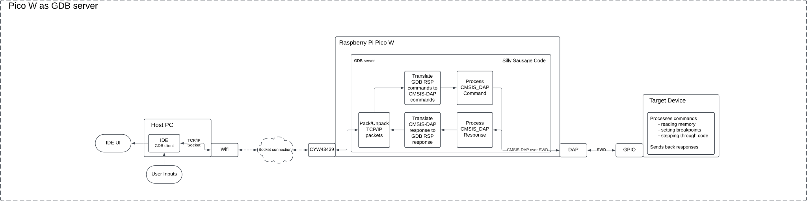
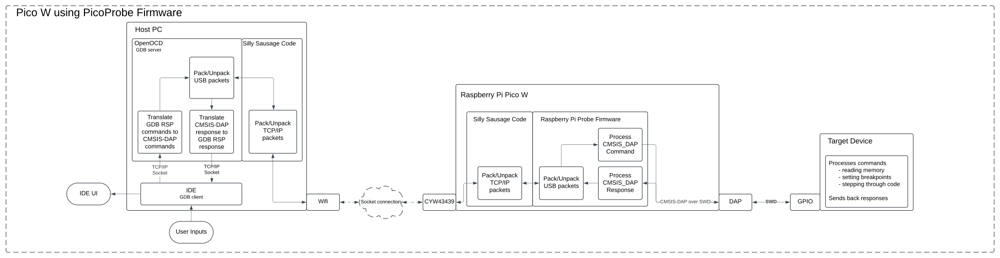
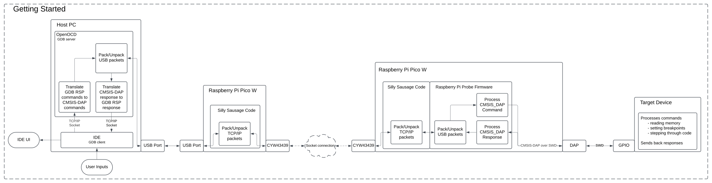

# Pico W as Remote Debugger

Silly Sausages

---

## Contents
- [Description](#description)
- [Core Features](#core-features)
  - [Debugging](#debugging)
  - [File System](#file-system)
    - SD card reader
    - FAT file system
  - [SSH and Secure File Transfer](#ssh-and-secure-file-transfer)
    - SCP server
    - WolfSSL
  - [Shell](#shell)

---

## Description
This project aims to develop an SWD debugger capable of remotely flashing 
and debugging firmware on any ARM Cortex-M series microcontroller.

The debugger establishes a TCP/IP socket connection with a host machine, 
allowing the host to send firmware to the debugger. 
The debugger then flashes the firmware onto a target device connected via SWD. 
Once the firmware is flashed, 
developers can initiate a debug session from the host machine using OpenOCD.

Additionally, the debugger will feature a file system for storing 
and accessing multiple firmware files. 
Users can securely upload firmware files to the debugger’s file system using an SCP server.

The debugger will also support SSH (Secure Shell), 
enabling users to remotely access the device and execute commands through an integrated shell. 
WolfSSL, a lightweight SSL/TLS library, might be used to implement the SSH and SCP functionality.

---

## Core Features
### Debugging
The project aims to develop an SWD debugger that can communicate with a host machine for remote debugging of ARM Cortex-M series microcontrollers. There are two primary approaches we're considering for implementing the debugging functionality:

Option 1: GDB Server on the Pico W
In this approach, the Pico W will act as a GDB server using OpenOCD. 
The host machine will run a GDB client (such as an IDE), 
which will connect to the Pico W over TCP/IP. The GDB client will send debugging commands, 
and the Pico W will forward these commands to the target device via SWD (Serial Wire Debug).
This setup will be the easiest for users of the debugger, 
as it provides a simple plug-and-play experience where developers can easily interact with the target device, 
set breakpoints, and inspect memory through the GDB interface.

Option 2: GDB Server on the Host Machine
Alternatively, we can run the GDB server on the host machine 
and modify OpenOCD to wrap outgoing USB packets into TCP/IP packets. 
The Pico W debugger will receive these TCP/IP packets, unpack them, 
and use the PicoProbe firmware to flash and debug the code on the target device.
This method might be easier to implement 
and reduces the processing load on the Pico W, 
as the host machine handles most of the heavy lifting.

To begin, we will set up a simple configuration with two Pico W devices. 
One Pico W will handle the OpenOCD commands, wrap them in TCP/IP packets, 
and send them to the second Pico W. The second Pico W will act as the debugger, 
unpacking the TCP/IP packets and using the PicoProbe firmware to flash 
and debug the target device.

### File System

### SSH and Secure File Transfer

### Shell

---
